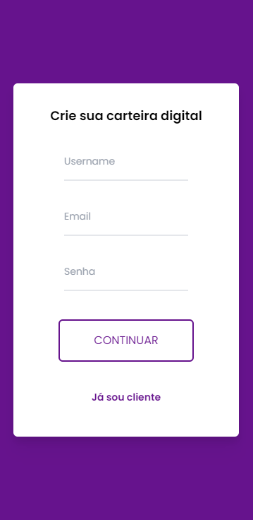
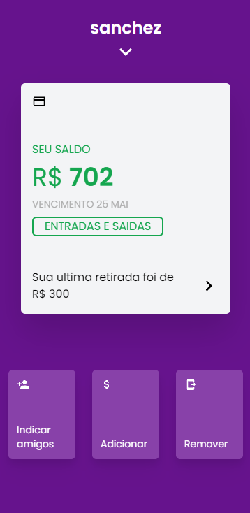
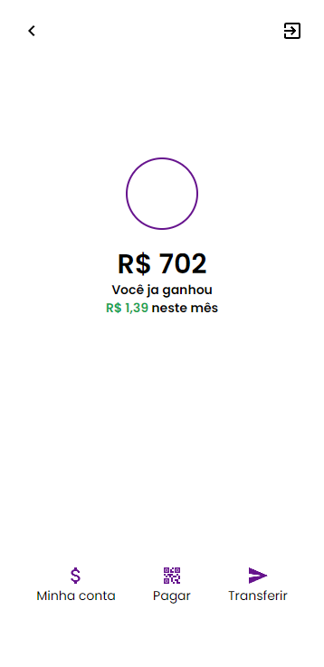

# Carteira Digital - Nubank UI

Carteira digital com interface igual da Nubank, com funcionalidades de criar sua conta, gerenciar entrada e saida e saldo, pagina de perfil do usuario e dashboard.

 

# 📸 Fotos

 

# 💻 O Projeto

O projeto é uma carteira digital aonde tentei me inspirar na interface do nubank, com as funcionalidades de criação de usuario, informações e controle de entrada e saída de saldo. 

- TailwindCSS foi utilizado pra desenvolver a interface, trabalhando também com a responsividade;
- Pra parte de Data Fetching, utilizei o Axios juntamente com uma fake api tratanto dos dados no context;
- Json-Server serviu como uma fake API.

# 🚀 Tecnologias

#### ✔️ ReactJS

#### ✔️ ViteJS

#### ✔️ TailwindCSS

#### ✔️ Json-Server

#### ✔️ Axios
